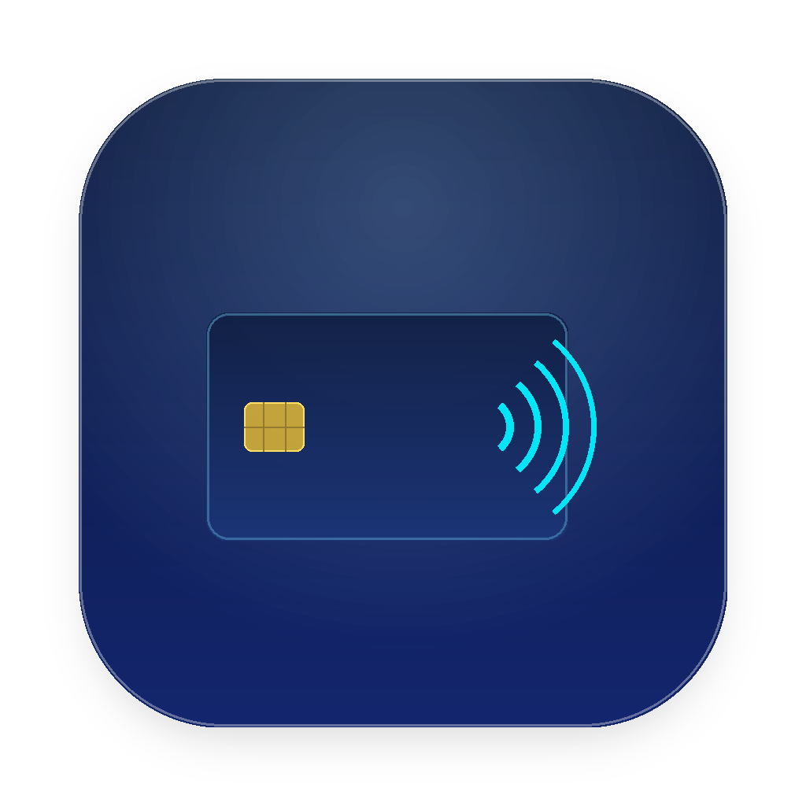

# AirCard-iOS

<p align="center">
  
</p>

<p align="center">
  <b>Apple Wallet card skins and lock screen passcode themes directly on iOS 17 – iOS 26+.</b>
</p>

<p align="center">
  
  
  
  
  
</p>

---

## Table of Contents
- [Overview](#overview)
- [The iOS 26+ Breakthrough](#the-ios-26-breakthrough)
  - [Why did previous methods break on iOS 26?](#why-did-previous-methods-break-on-ios-26)
  - [The Solution: RemotePairing (RSD) & `alt_irk`](#the-solution-remotepairing-rsd--alt_irk)
- [Features](#features)
- [AirCard Injector (macOS GUI App)](#aircard-injector-macos-gui-app)
- [Step-by-Step Guide for iOS 26](#step-by-step-guide-for-ios-26)
- [CLI Tool for Linux & Windows](#cli-tool-for-linux--windows)
- [Building From Source](#building-from-source)
- [Repository Structure](#repository-structure)
- [Credits & Acknowledgments](#credits--acknowledgments)
- [License](#license)

---

## Overview

AirCard-iOS writes custom artwork to iOS system caches over a local loopback connection. It allows you to customize Apple Wallet card artwork and the passcode dialer directly on your device without keeping a computer connected.

The core filesystem injection is powered by a Rust static library (`AirliftFFI`) that executes the AirTraffic protocol over a local tunnel managed by **LocalDevVPN**.

---

## The iOS 26+ Breakthrough

### Why did previous methods break on iOS 26?

1. **Removal of on-device Developer Mode pairing**: Starting in iOS 26, Apple removed the built-in Bonjour pairing service in *Settings › Privacy & Security › Developer Mode › Pair with...*. Devices can no longer pair with themselves through the Settings menu.
2. **Lockdownd loopback blocking**: Apple hardened local socket routing. Attempting to connect to `lockdownd` on port `62078` over virtual network interfaces (LocalDevVPN, `utun`) results in immediate socket errors:
   ```
   connect to lockdownd on 10.7.0.1:62078 failed: Socket(Os { code: 32, kind: BrokenPipe })
   ```
3. **Missing `alt_irk` in legacy pairing files**: Legacy lockdown plists (or basic iLoader exports) only include USB lockdown certificates. Without the full Ed25519 RemotePairing handshake containing `alt_irk` (16-byte Identity Resolving Key), the device terminates RSD handshakes (`Connection reset by peer`) on port `49152`, causing 4-minute connection timeouts.

### The Solution: RemotePairing (RSD) & `alt_irk`

The only valid internal channel on iOS 17+ and iOS 26 is **RemotePairing (RSD) on port `49152`**.

By pairing the iPhone once using **[`idevice_pair`](https://github.com/jkcoxson/idevice_pair)** (developed by **[@jkcoxson](https://github.com/jkcoxson)**), a full RemotePairing record is negotiated with Apple's `remotepairingd`. This generates a `pairingFile.plist` that includes:
- `alt_irk` (16 bytes)
- `e_private_key` and `e_public_key`
- `identifier`

When this pairing record is embedded into `AirCard-iOS.app`, the Rust engine authenticates to `10.7.0.1:49152` instantly, bypassing lockdownd restrictions and enabling live card scanning and skin injection on iOS 26.

---

## Features

### Wallet Card Skins
- Renders images to Wallet specifications (`cardBackgroundCombined@3x.png` at 1536×969, `@2x` at 1024×646, and `cardBackgroundCombined.pdf` for Suica / transit cards).
- Automatically purges local pass caches (`FrontFace`, `Preview`, `PlaceHolder`) so changes appear immediately when Wallet restarts.
- Set artwork for individual cards or apply globally across all detected passes.
- **Live Card Detection**: Automatically detects the active card pass identifier when you trigger Apple Pay.

### Passcode Keypad Themes
- Interactive dialer preview with touch panning and zoom framing.
- **Poster layout**: Spans a single image across all ten keypad buttons.
- **Circle button layout**: Fits cropped images inside each keypad dial.
- Supports system cache targets including `TelephonyUI-10`.
- Supports localized number subtexts (Ukrainian, Russian Cyrillic, and standard Latin).
- Imports and exports themes as `.passthm` archives.

---

## AirCard Injector (macOS GUI App)

To make pairing and installation effortless for everyone, we built **AirCard Injector** — a native macOS SwiftUI application packaged in a custom styled DMG disk image.

<p align="center">
  
</p>

### Key Highlights:
- **Universal 2 Binary**: Runs natively on Apple Silicon (M1/M2/M3/M4) and Intel Macs.
- **Embedded `idevice_pair`**: Includes the pairing helper inside the app bundle — no terminal or command-line tools needed.
- **Auto-Detection**: Automatically detects your connected device's `pairingFile.plist` from `idevice_pair` or system lockdown stores.
- **1-Click Injection**: Injects the pairing credentials into `AirCard-iOS.ipa` and produces a ready-to-sideload IPA.
- **Clean & Private**: Runs completely locally with zero telemetry and zero external server dependency.

You can build the DMG yourself using `./tools/mac-injector/build_app.sh` or download the prebuilt release.

---

## Step-by-Step Guide for iOS 26

### Step 1: Generate the Pairing File
1. Open **AirCard Injector** on your Mac.
2. Connect your iPhone via USB cable and unlock it (tap *Trust This Computer* if prompted).
3. In AirCard Injector, click **"⚡ Run idevice_pair Helper"**.
4. In the helper window, select your connected iPhone and complete the pairing.
5. The `pairingFile.plist` will be saved to your `Documents` folder and automatically selected in the injector.

### Step 2: Inject Credentials into the IPA
1. Select your base `AirCard-iOS.ipa` in AirCard Injector.
2. Click **"Inject Pairing & Build IPA"**.
3. Choose where to save your personalized `AirCard-iOS-Personalized.ipa`.

### Step 3: Install & Activate on iOS 26
1. Sideload the personalized IPA using **AltStore**, **SideStore**, **TrollStore**, **Feather**, or **iLoader**.
2. Install and launch **LocalDevVPN** on your iPhone. Ensure it is connected (status: `VPN=UP`).
3. Open **AirCard-iOS**. The app will detect the embedded pairing record and connect to `10.7.0.1:49152` over RSD.
4. Tap **"Start Live Card Scanner"**, double-click your power button to bring up Apple Pay, and customize your cards!

---

## CLI Tool for Linux & Windows

For users on Linux or Windows, a standalone Python CLI tool is provided:

```bash
# Install dependencies (Python 3.8+ required)
python3 tools/cli-injector/inject_pairing.py -i AirCard-iOS.ipa -p pairingFile.plist -o AirCard-iOS-Personalized.ipa
```

---

## Building From Source

### Requirements
- macOS 14.0 or newer with Xcode 16 or newer
- XcodeGen (`brew install xcodegen`)
- create-dmg (`brew install create-dmg`, for building the DMG)
- Rust toolchain (`rustup target add aarch64-apple-ios`)

### Build the iOS IPA
```bash
git clone https://github.com/merybist/AirCard-iOS.git
cd AirCard-iOS
./build-ipa.sh
```
The resulting archive is placed at `build/AirCard-iOS.ipa`.

### Build the macOS AirCard Injector DMG
```bash
./tools/mac-injector/build_app.sh
```
The DMG image is generated at `AirCardInjector.dmg`.

---

## Repository Structure

```
AirCard-iOS/
├── ios-app/                   # SwiftUI iOS application
│   ├── AirCardApp.swift       # App lifecycle
│   ├── AppViewModel.swift     # State management and exploit orchestration
│   ├── ContentView.swift      # Main UI views & live scanner interface
│   ├── Models.swift           # Image slicing, theme layout, archive packing
│   ├── PairingController.swift# Bonjour & RemotePairing controller
│   ├── NetworkStatus.swift    # VPN loopback detection & interface polling
│   ├── Utilities.swift        # Audio keep-alive and system helpers
│   ├── GrappaHelper.[h,m]     # ATC protocol helpers
│   ├── Info.plist             # Bundle configuration
│   └── Assets.xcassets/       # App icons and assets
├── tools/
│   ├── mac-injector/          # Native macOS SwiftUI Injector application
│   │   ├── main.swift         # SwiftUI app source code (English)
│   │   ├── build_app.sh       # Universal 2 compilation & DMG packager
│   │   └── assets/            # AppIcon.icns & custom DMG background
│   └── cli-injector/          # Cross-platform CLI injector (Linux / Windows)
│       └── inject_pairing.py  # Standalone pairing injection script
├── AirliftFFI.xcframework/    # Compiled arm64 Rust static library & headers
├── rust-core/                 # Rust core source code (AirTraffic & RemotePairing)
├── project.yml                # XcodeGen project definition
├── build-ipa.sh               # Script to build and package the iOS IPA
├── build-ios.sh               # Script to rebuild the Rust xcframework
├── LICENSE                    # MIT License
└── README.md                  # Project documentation
```

---

## Credits & Acknowledgments

- **[@mak5er](https://github.com/mak5er)**: Original author of AirCard-iOS — architecture, UI, passcode theming engine, and pairing automation.
- **[@merybist](https://github.com/merybist)**: iOS 26 RemotePairing research, RSD tunnel fixes, `alt_irk` authentication discovery, native macOS AirCard Injector app & DMG packaging.
- **[@jkcoxson](https://github.com/jkcoxson)**: Creator of **[`idevice_pair`](https://github.com/jkcoxson/idevice_pair)** and the **[`idevice`](https://github.com/jkcoxson/idevice)** Rust crate. The breakthrough in iOS 26 pairing was made possible thanks to his work reverse-engineering Apple's RemotePairing protocol.
- **[AirLift](https://github.com/0xjohnnydev/airlift)** by **[0xjohnny (@0xjohnnydev)](https://github.com/0xjohnnydev)**: Original AirTraffic/ATAirlock sandbox escape research underlying `AirliftFFI`.

---

## License

MIT License. See [LICENSE](LICENSE) for details.
